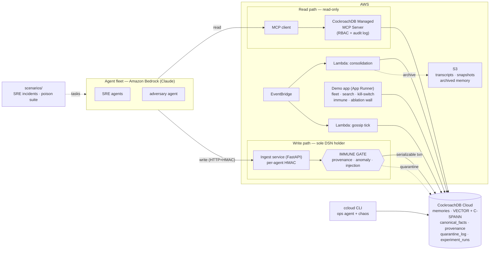
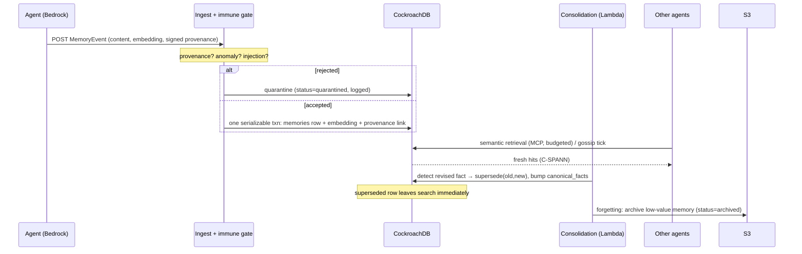
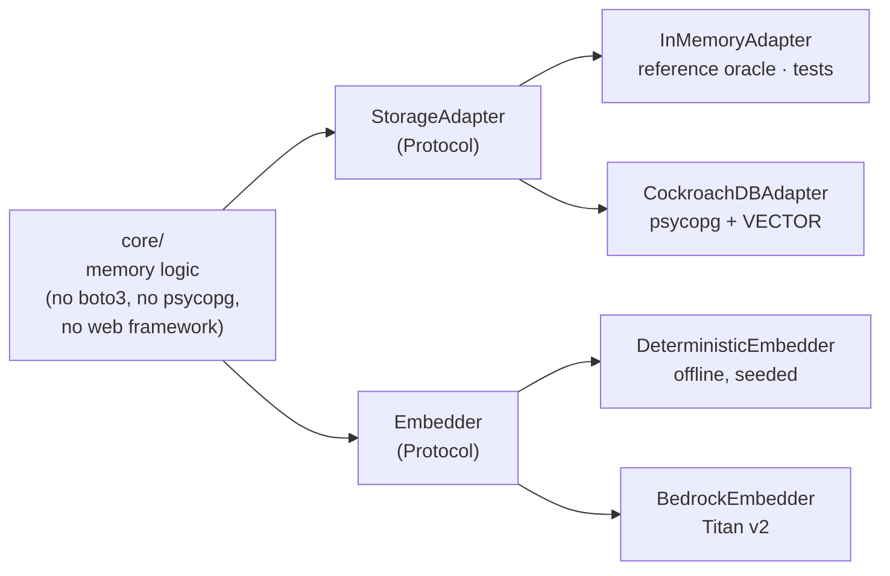

# Aletheia — architecture

> **Status.** The core memory layer, the read/write paths, the fleet, the five
> components, the experiment harness and the demo app are **implemented and tested**
> (409 unit tests + 16 integration tests against a live CockroachDB). Concurrency
> (R1) and chaos (R2) results are **real** ([`results.md`](results.md)). What
> remains is provisioning-gated: the live cloud deployment, R3/R3b (needs Amazon
> Bedrock), and running E2 against CockroachDB Cloud rather than the local
> three-node cluster. Nothing below is aspirational unless it says so.

Aletheia is the shared memory layer of a fleet of agents. Everything is organised
around one asymmetry: **agents are unreliable, the memory must not be.**

## 1. System architecture



## 2. Read path ≠ write path

This separation is the security spine of the design, not a detail.

| | Read | Write |
|---|---|---|
| Entry point | CockroachDB **Managed MCP Server** | **Ingest service** (`ingest/`, FastAPI) |
| Auth | Service-account API key, read-only | Per-agent token, HMAC-signed payloads |
| Who holds the DSN | nobody but the ingest service | the ingest service |
| Enforcement | RBAC + platform audit log | Immune gate before the transaction |

The MCP server is read-only by default. Rather than treating that as a limitation
to work around, we treat it as least privilege: agents can read institutional
memory directly, but **no agent can write to the database without passing through
validation**. This is the concrete answer to "does the agent use the tools
correctly and safely?".

`core/` holds no DSN. It lives only in the ingest service. The boundary is
enforced statically and at runtime by `tests/test_architecture.py`.

## 3. The five components

All five are **implemented and behind their feature flag** in `AletheiaConfig`.
The experimental ablations and the demo kill-switch are the same four booleans.

| | Component | Module | Flag |
|---|---|---|---|
| C1 | Fast write + budgeted retrieval | `core/memory.py` | — |
| C2 | Consolidation cycle (knowledge-update, canonical promotion) | `core/consolidation.py` | `enable_consolidation` |
| C3 | Metabolic forgetting (token budget, archive to S3) | `core/forgetting.py` | `enable_forgetting` |
| C4 | Gossip between agents (degradation by hop) | `core/gossip.py` | `enable_gossip` |
| C5 | Immune system (provenance, anomaly, injection → quarantine) | `core/immune.py` | `enable_immune` |

## 4. Life of a memory



The single serializable transaction in step *accepted* is the CockroachDB argument
in one line: **there is no window in which a vector exists without its operational
row**. The logical removal in `supersede` is reflected in the vector index
immediately — the C-SPANN freshness property, asserted in `smoke.py`.

## 5. Portability boundary

`core/` contains the memory logic and imports no infrastructure. Storage enters
through `core.adapter.StorageAdapter`; embeddings through `core.embeddings.Embedder`;
the S3 offload through an injected callback.



The same demo app `create_app(adapter, embedder)` serves the seeded offline world
or a live CockroachDB + Bedrock one with no code change — the seam is the adapter.

## 6. The tools, and what the agent does with each

The hackathon asks which CockroachDB tools were used and **what the agent did with
them**. All four are used for real:

| CockroachDB tool | What the agent does with it |
|---|---|
| **Managed MCP Server** | The fleet's read path: semantic + relational memory queries under a read-only service account (`agents/read_client.py`) |
| **Distributed Vector Indexing (C-SPANN)** | Semantic memory: `VECTOR(1024)` embeddings indexed for retrieval, fresh immediately after insert/supersede (`adapters/cockroach.py`) |
| **ccloud CLI (agent-ready)** | Provisioning, backups, and the E2 chaos experiment — killing a node under load (`chaos/`) |
| **Agent Skills repo** | Operational skills mounted on the ops agent for cluster diagnosis via SQL |

| AWS service | Role |
|---|---|
| **Amazon Bedrock** | Fleet models (Claude) + Titan embeddings (`adapters/bedrock_embedder.py`) |
| **AWS Lambda + EventBridge** | Consolidation cycle and gossip ticks on a schedule (`lambdas/`) |
| **Amazon S3** | Incident transcripts, experiment snapshots, archived (forgotten) memories |
| **AWS App Runner** | The public demo app (`Dockerfile`, `infra/deploy_demoapp.sh`) |

## 7. Schema

See [`infra/ddl.sql`](../infra/ddl.sql). Two invariants the schema encodes:

* **Nothing is deleted.** `supersede`, `quarantine` and `archive` are status
  transitions. The history is the audit trail, and the audit trail is the product.
* **Multi-table writes are atomic.** `memories` and `provenance` are always
  written in the same transaction.

## 8. What is verified, and how

Against `cockroachdb/cockroach:v25.4.13`:

* Full schema applies, including `CREATE VECTOR INDEX idx_mem_embedding`, and the
  default transaction isolation is `serializable` (`smoke.py --local`).
* 1024-dimension vectors round-trip through the `VECTOR` column.
* `EXPLAIN` confirms the vector index serves the **filtered** retrieval the fleet
  actually issues, pruned to the active partition:
  `• vector search  table: memories@idx_mem_embedding  prefix spans: [/'active' - /'active']`.
* A superseded memory leaves the search results **immediately**, with no reindex.
* **R1 (concurrency), real:** under 20 concurrent writers the naive non-transactional
  baseline loses ~90% of writes and diverges its vectors; CockroachDB `SERIALIZABLE`
  is inconsistency-free. **R2 (chaos), real:** a `docker kill` of a node mid-write,
  mid-consolidation lost **zero** acknowledged memories, corrupted nothing (checksum
  verified), and the fleet kept writing through a 26 ms blip. See [`results.md`](results.md).
* The demo image builds and runs standalone: `/healthz`, live search, provenance,
  the kill-switch/ablation wall and a real launch-an-attack immune panel all serve.

Provisioning-gated (harness ready, not yet run against cloud): E3 knowledge-update,
E4 poisoning, E5 cost, E3b LongMemEval (these populate table R3); the public App
Runner URL; E2 against CockroachDB Cloud's Disruption API rather than the local cluster.

## 9. Resolved decisions

### 9.1 Filtered vector search — prefix columns *(decided 2026-07-24)*

CockroachDB routes a query through the vector index only when the query's filters
are covered by the index. Retrieval must exclude superseded, quarantined and
archived memories, so the index carries `status` as a **prefix column**:

```sql
CREATE VECTOR INDEX idx_mem_embedding ON memories (status, embedding vector_cosine_ops);
```

Measured against v25.4.13: with the index on `(embedding)` alone, `WHERE status =
'active' ORDER BY embedding <=> $1 LIMIT k` plans as a **full scan**; with the
prefix it plans as `vector search … prefix spans: [/'active' - /'active']` — the
index is used *and* only the active partition is searched.

### 9.2 Distance operator — cosine, by contract *(decided 2026-07-24)*

`vector_cosine_ops` on the index, `<=>` in every query. `InMemoryAdapter` scores
with cosine too, so the two adapters agree **by contract** rather than by the
coincidence that L2 and cosine rank unit-length vectors identically.

### 9.3 Serialization-error retry *(implemented, Phase 1)*

The production `CockroachDBAdapter` wraps writes in a retry loop on SQLSTATE
`40001`: under concurrent writers some serializable conflicts require an
application-level retry. This is what makes R1's "0 inconsistencies" hold without
lost work.

### 9.4 Where the chaos experiment runs *(decided 2026-07-24)* — see §11.

## 10. Provisioning-gated items

Recorded so they are not rediscovered late.

1. **Bedrock model ids / region.** `core/config.py` carries defaults; the exact ids
   and their availability in the target region are confirmed in the Bedrock console
   before any experimental run.
2. **MCP Server availability on the plan.** The read path depends on it; confirmed
   in the Cloud console during provisioning.
3. **E3b — external validation on LongMemEval** (project plan §8.1, §8.4). The
   knowledge-update arms are replayed on a stratified subset of the public benchmark
   (knowledge-update + temporal-reasoning categories only). Artefacts:
   `scenarios/longmemeval/SUBSET.md` and `experiments/scoring_lme.py`.
4. **Ablation wall — live fleets or synchronised replays** (project plan §9.1.6).
   The demo already serves the four-panel wall from the same feature flags; the only
   open call is whether the video shows four live fleets or synchronised replays of
   real runs — to be decided on measured cost and **stated in the video**, since a
   replay presented as a live fleet is exactly the disguised mock the project plan
   §3.2 forbids.

## 11. The chaos cluster (E2)

E2 is the thesis: kill a node mid-consolidation with 20 agents writing, and the
fleet keeps remembering. CockroachDB Cloud manages nodes and does not expose node
termination as a user operation, so the experiment runs against a cluster we
operate ourselves — `docker-compose.chaos.yml`, three real nodes, real Raft
replication, `num_replicas = 3` so quorum survives losing one.

**Nothing about the failure is simulated.** `docker kill` sends SIGKILL: no drain,
no graceful shutdown, the node simply stops — a harsher event than a managed
platform would ever give us.

```bash
docker compose -f docker-compose.chaos.yml up -d
./chaos/verify_cluster.sh                     # assert 3 live nodes before claiming anything
docker kill aletheia-chaos-2                  # the real event
python -m chaos.run_e2                         # measured: loss, integrity, recovery → R2
```

**The condition attached to this choice is not optional** (project plan §11): the
video and the README state plainly that the kill happens on a self-operated
three-node cluster, and why. A viewer must never be left to assume it was the
managed cluster. Faking a kill would be disqualifying; explaining an honest
substitution costs nothing and, with this jury, is worth more than the illusion.
